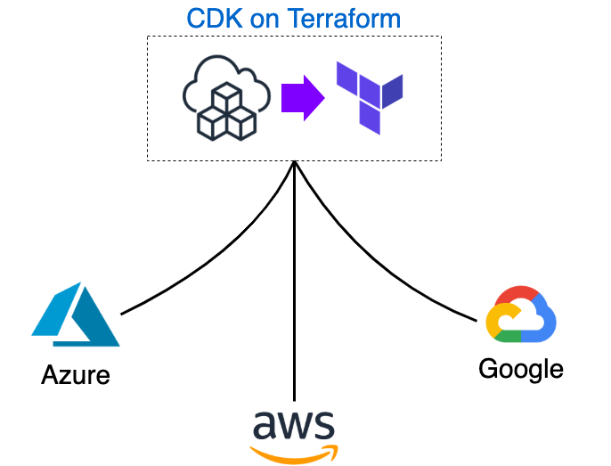

## CDK on Terraform Deploy Multiple Cloud samples


## Table of contents

- [Architecture](#architecture)
- [Deployment](#deployment-steps)
- [Parameters](#parameters)
- [Test](#test)

## Architecture
###  Architecture Diagram

This architecture includes multi-cloud deployment, refer to [AWS](./img/aws.png), [Azure](./img/azure.png) and Google architecture for details.



## Deployment Steps
###  Step 1. Install Terraform and CDK on Terraform

- Install Terraform (MacOS)

```
$ brew tap hashicorp/tap
$ brew install hashicorp/tap/terraform
$ terraform version
```

- Install cdktf

```bash
$ npm install -g cdktf-cli
$ cdktf --version
```

###  Step 2. Define your environment variables

You can refer [config/default.json](https://github.com/shazi7804/cdktf-samples/blob/master/config/default.json) to define environment variables.

- Customize common tags for all resources.

```json
{
    "Tags": {
        "CreateBy": "cdktf",
        "Owner": "<your-name>"
    }
}
```

- Customize network subnet with multiple cloud.

```json
{
    "Providers": {
        "Aws": {
            "Regions": ["us-east-1"],
            "Vpc": {
                "cidr": "10.0.0.0/16",
                "privateSubnets": [
                    "10.0.0.0/21",
                    "10.0.8.0/21"
                ],
                "publicSubnets": [
                    "10.0.16.0/21",
                    "10.0.24.0/21"
                ],
        "Azure": {
            "Regions": ["eastus"],
            "Network": {
                "cidr": "10.0.0.0/16",
                "privateSubnets": [
                    "10.0.0.0/21",
                    "10.0.8.0/21"
                ],
                "publicSubnets": [
                    "10.0.16.0/21",
                    "10.0.24.0/21"
                ]
            }
        }
    }
}
```

- Customize kubernetes with multiple cloud.


```json
{
    "Providers": {
        "Aws": {
            "Eks": {
                "name": "cdktf",
                "instanceType": ["m4.large"],
                "instanceCount": 1,
                "version": "1.18"
            }
        },
        "Azure": {
            "Aks": {
                "name": "cdktf",
                "instanceType": ["Standard_D2_v2"],
                "instanceCount": 1,
                "dnsPrefix": "cdktf-kubernetes",
                "version": "1.17.11"
            }
        }
    }
}
```

###  Step 3. Create an execution plan

```bash
$ cdktf plan
```

###  Step 4. Deploy the changes configuration

```bash
$ cdktf deploy
```

If you like the style of [terraform](https://www.terraform.io/) output, you can execute `make plan && make deploy`. more detail reference [Makefile](https://github.com/shazi7804/cdktf-samples/blob/master/Makefile)

## Parameters

You can customize environment parameters in [config/default.json](https://github.com/shazi7804/cdktf-samples/blob/master/config/default.json)

Parameters | Description
---------- | -----------
StackName | The parameter of this stack name. default is `cdktf`
Tags | The parameter of this stack common tags. default is `{ "CreateBy": "cdktf", "SampleFrom": "https://github.com/shazi7804" }`
Providers | The parameter of providers of this stack.
